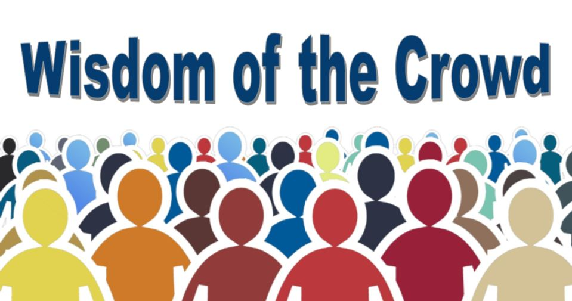

---

# Ensemble Methods

**Ensemble methods** Ensemble methods is a machine learning technique that combines several base models in order to produce one optimal predictive model. 

When making Decision Trees, there are several factors we must take into consideration: On what features do we make our decisions on? What is the threshold for classifying each question into a yes or no answer? By adding an additional question, we hope to greater define the Yes and No classes.

This is where Ensemble Methods come in handy! Rather than just relying on one Decision Tree and hoping we made the right decision at each split, Ensemble Methods allow us to take a sample of Decision Trees into account, calculate which features to use or questions to ask at each split, and make a final predictor based on the aggregated results of the sampled Decision Trees. There are two most popular types of Ensemble methods:

1. **Bagging**

2. **Random Forests**

Bagging, also known as bootstrap aggregation, is the ensemble learning method that is commonly used to reduce variance within a noisy dataset. In bagging, a random sample of data in a training set is selected with replacement—meaning that the individual data points can be chosen more than once. After several data samples are generated, these weak models are then trained independently, and depending on the type of task—regression or classification, for example—the average or majority of those predictions yield a more accurate estimate. 

As a note, the random forest algorithm is considered an extension of the bagging method, using both bagging and feature randomness to create an uncorrelated forest of decision trees.

Ensemble learning gives credence to the idea of the **wisdom of crowds** which suggests that the decision-making of a larger group of people is typically better than that of an individual expert. Similarly, ensemble learning refers to a group (or ensemble) of base learners, or models, which work collectively to achieve a better final prediction. A single model, also known as a base or weak learner, may not perform well individually due to high variance or high bias. However, when weak learners are aggregated, they can form a strong learner, as their combination reduces bias or variance, yielding better model performance.

https://towardsdatascience.com/ensemble-methods-in-machine-learning-what-are-they-and-why-use-them-68ec3f9fef5f
https://www.ibm.com/cloud/learn/bagging
