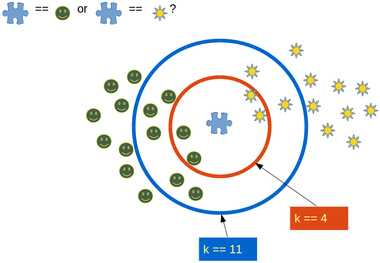

# K-nearest Neighbors
K-Nearest Neighbours is one of the most basic yet essential classification algorithms in Machine Learning. It belongs to the supervised learning domain and finds intense application in pattern recognition, data mining and intrusion detection.
It is widely disposable in real-life scenarios since it is non-parametric, meaning, it does not make any underlying assumptions about the distribution of data (as opposed to other algorithms such as GMM, which assume a Gaussian distribution of the given data).
We are given some prior data (also called training data), which classifies coordinates into groups identified by an attribute.

    

KNN — makes decision based on the entire training data set (in the best case a subset of them). The training phase is costly as well . Costly in terms of both time and memory. In the worst case,more time might be needed as there is probability of all data points taking point in decision.Since all the training data is stored so more memory is needed. Each of the training data consists of a set of vectors and class label associated with each vector.
