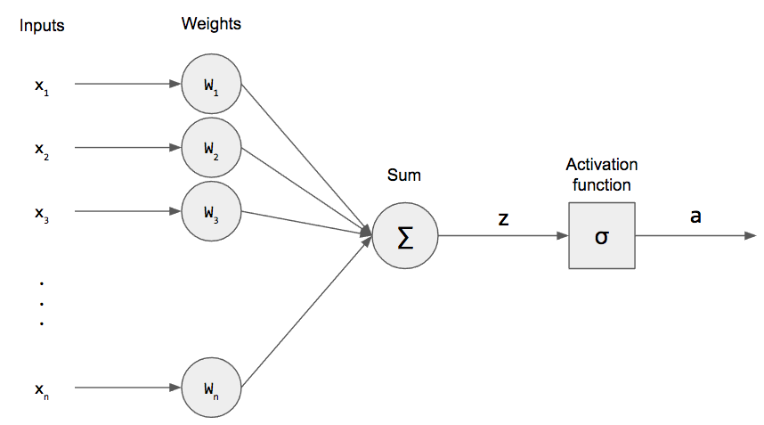

---
# The Perceptron

A perceptron is a neural network unit (an artificial neuron) that does certain computations to detect features or business intelligence in the input data. And this perceptron tutorial will give you an in-depth knowledge of Perceptron and its activation functions.

Perceptron was introduced by Frank Rosenblatt in 1957. He proposed a Perceptron learning rule based on the original MCP neuron. A Perceptron is an algorithm for supervised learning of binary classifiers. This algorithm enables neurons to learn and processes elements in the training set one at a time.

There are two types of Perceptrons: Single layer and Multilayer.

    

https://pythonmachinelearning.pro/perceptrons-the-first-neural-networks/

Single layer - Single layer perceptrons can learn only linearly separable patterns
Multilayer - Multilayer perceptrons or feedforward neural networks with two or more layers have the greater processing power
The Perceptron algorithm learns the weights for the input signals in order to draw a linear decision boundary.

This enables you to distinguish between the two linearly separable classes +1 and -1.
